# DSS - Pre-Gate Parking Layout
## Instructions
1. Install necessary libraries (numpy, simpy, pyqt5)
2. Navigate to the frontend folder, sub-folder ui and run main_revised.py
3. Use GUI to simulate parking layouts and retrieve results

## Known Issues
- Once a simulation is run and the user wants to run another simulation the program must be closed and relaunched. Otherwise the simulation gets stuck and wont finish.

## How to use
Run main_revised.py from the frontend - the GUI will open.
The user starts in the input tab and may later change to the output tab to receive simulation results.
Once the layout is valid the user may also enter different parameters for the simulation.
Finally, press the simulation button to run the simulation.
Once the simulation is run, the user can navigate to the output tab and click the retrieve results button.
Afterward, the results and visualizations are shown.
### Step 1.) Creating a road
- Select the area type Road from the area type drop-down menu.
- Select the allowed vehicle types (checkboxes).\
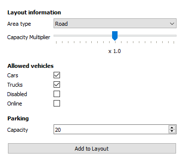
- Start clicking the layout starting from one side. Clicked tiles turn grey to mark the current selection.\
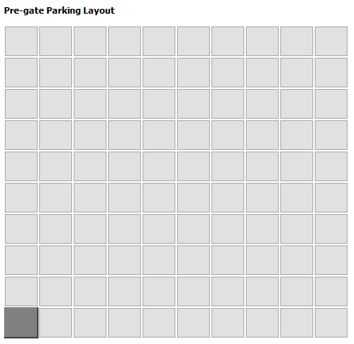
- Continue building the road until the desired endpoint is reached.\
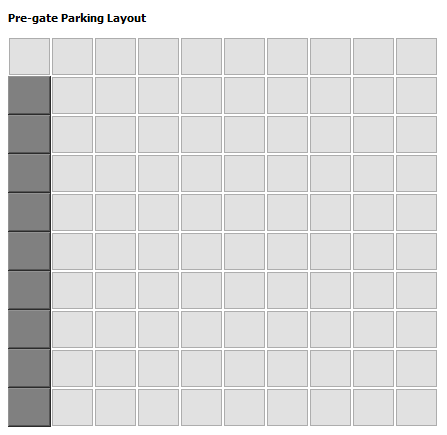
- To place the road click on the Add to layout button.\
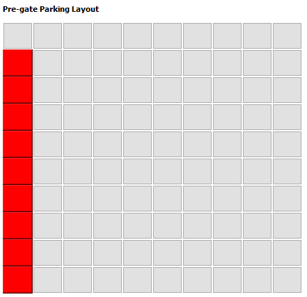
- The placed road should now appear in red on the layout.

### Step 2.) Creating a road connection
- First click the connection point where the two roads should connect. The tile will turn orange to indicate, that there is a tile overlap (connection).
- Then continue to draw the road as in the last example.\
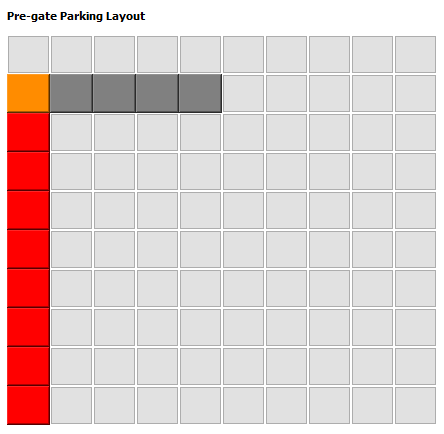
- Once the road is complete, click the Add to layout button.
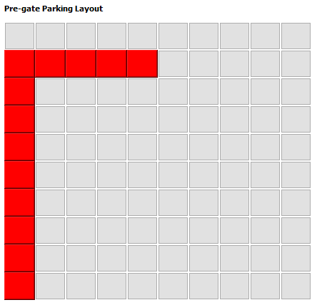
- The road will now appear as a regular road (red).

### Step 3.) Connecting check-in gate
- Check-in gates must be placed in the top row of the layout.
- Select the area type Check-in from the area type drop-down menu.
- Select the allowed vehicle types (checkboxes).\
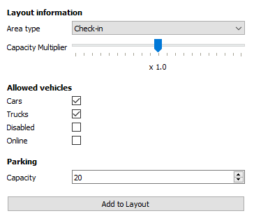
- Click on a tile in the top row next to (above) the road.
- Next click on a tile on the road (connection).\
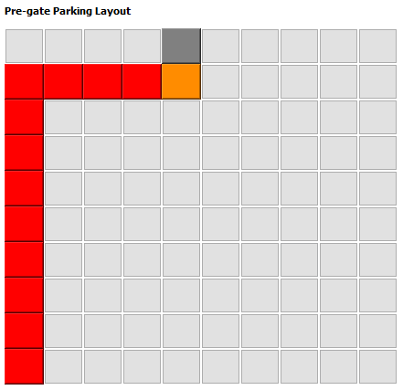
- Click the Add to layout button.\
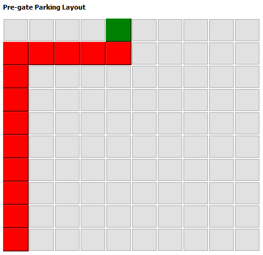
- The check-in gate will now appear (green).

### (optional) Step 4.) Connecting a parking space
- See section "Example connecting check-in gate" and change the area type to Parking.
- Set the preferred parking capacity.\
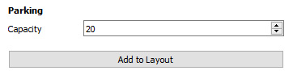
- Click the Add to layout button.\
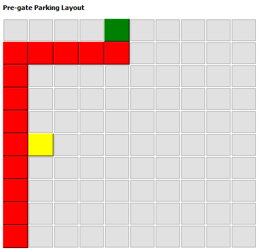
- The parking lot will now appear (yellow).

### Step 5.) Connecting an entry
- Entry gates must be placed in the bottom row of the layout.
- Select the area type Entry from the area type drop-down menu.
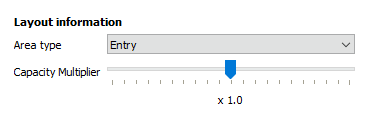
- Click on a existing road tile in the bottom row.\
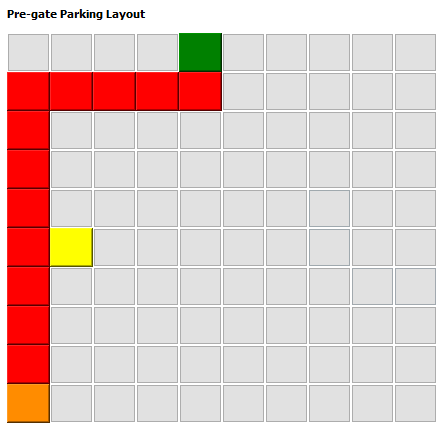
- Click the Add to layout button.\
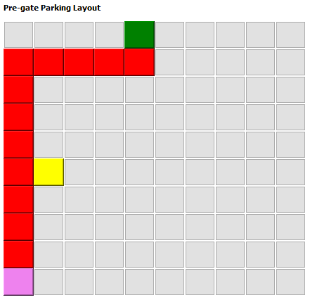
- The entry will now appear on the road (violet).

### Step 6.) Set general and budget parameters
- Choose preferred parameters regarding budget information and general information.
- Grayed out field will not be considered.\
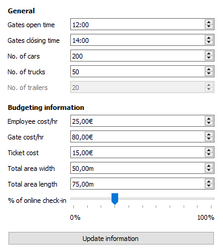

### Step 7.) Run the simulation
- In case the layout and parameters have been entered successfully, the simulation can be started.
- Click the Simulate! button (note that the status is OK).
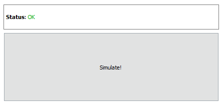

### Step 8.) Retrieve simulation results
- Click on the output tab in the top left corner.\
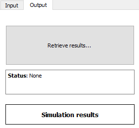
- Next click the Retrieve results button. After a few seconds, the results and visualizations appear.
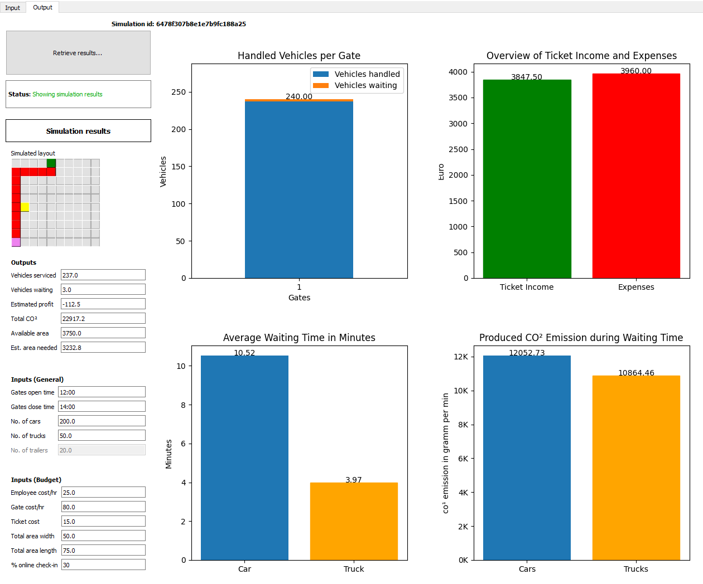
- Input parameters, calculated output parameters, the simulated layout and the charts will be shown to support the decision process of choosing a pre-gate parking layout.
- To run another simulation, restart the application and proceed as described in the how to section (known issue).